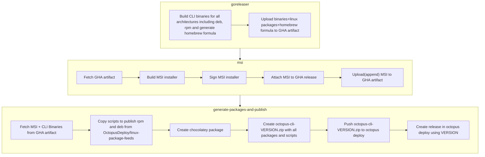
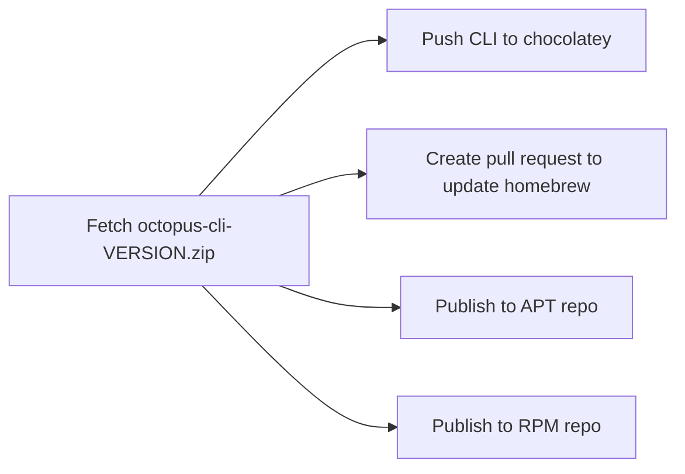

# Distribution of the CLI

This document explains the process by which the CLI is distrbuted to various package management systems, such as Homebrew, Chocolatey, and apt.

## Pipeline

The following process happens on each merge of a PR to main

When the team decides to create a release, we do so by merging the changelog PR that  release-please has been keeping up to date.

This creates a new GitHub release, and also a Git Tag with the corresponding version number (e.g. `v2.1`)

Upon creation of the git tag, a `goreleaser` workflow runs, which builds the binaries and kicks off the distribution flow:

The GoReleaser Github Actions workflow does most of the heavy lifting, as follows

## GoReleaser Github Workflow

After which point Octopus is used to publish the packages to the external marketplaces, using the following deployment process.
The lifecycle is configured to automatically deploy upon release creation

## Octopus Deployment Process

