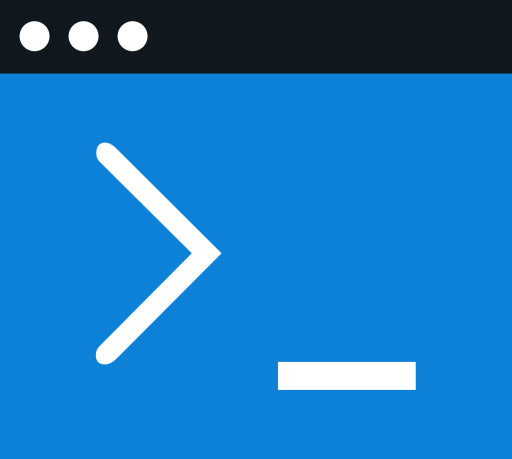

<div align="center">
  
  <h3 align="center">cli</h3>
  <p align="center">Command Line Interface for <a href="https://octopus.com/">Octopus Deploy</a> 🐙</p>
  <p align="center">
    <a href="https://github.com/OctopusDeploy/cli/releases/latest"></a>
    <a href="https://goreportcard.com/badge/github.com/OctopusDeploy/cli"></a>
  </p>
</div>

---

## Installation

#### Linux & macOS - CURL script

In your Terminal, run the following command:

```shell
curl -L https://github.com/OctopusDeploy/cli/raw/main/scripts/install.sh | bash
```

This will install Octopus CLI in `/usr/local/bin`. Depending on the permission of `/usr/local/bin`, you may need to provide your sudo password.

If you would like to install to a different location, set the `INSTALL_PATH` variable accordingly:

```shell
curl -L https://github.com/OctopusDeploy/cli/raw/main/scripts/install.sh | INSTALL_PATH=$HOME/bin bash
```

You can also install a specific version by providing the `VERSION` variable:

```shell
curl -L https://github.com/OctopusDeploy/cli/raw/main/scripts/install.sh | VERSION=v0.4.0 bash
```

#### Windows - MSI file

Navigate to latest release on the [GitHub releases page](https://github.com/OctopusDeploy/cli/releases) and expand the **Assets** list.

Download and run the file `octopus_[version]_Windows_x86_64.msi`

*Note:* At this time, the installer is x64 only. If you are using Windows on ARM, download the manual archive instead.

#### Windows - Chocolatey

```shell
choco install octopus-cli
```

*Note:* At this time, the chocolatey package is x64 only. If you are using Windows on ARM, download the manual archive instead.

#### macOS - Homebrew

```shell
brew install octopusdeploy/taps/octopus-cli
```

The Homebrew package has native support for macOS Intel and Apple Silicon

#### Linux (debian/ubuntu based distributions)

```shell
apt-get update && apt-get install --no-install-recommends gnupg curl ca-certificates apt-transport-https && \
  install -m 0755 -d /etc/apt/keyrings && \
curl -fsSL https://apt.octopus.com/public.key | sudo gpg --dearmor -o /etc/apt/keyrings/octopus.gpg && \
chmod a+r /etc/apt/keyrings/octopus.gpg && \
echo \
  "deb [arch="$(dpkg --print-architecture)" signed-by=/etc/apt/keyrings/octopus.gpg] https://apt.octopus.com/ \
  stable main" | \
  tee /etc/apt/sources.list.d/octopus.list > /dev/null && \
sudo apt-get update && sudo apt-get install octopus-cli

# for legacy Ubuntu/Debian (< 18.04) use
sudo apt update && sudo apt install --no-install-recommends gnupg curl ca-certificates apt-transport-https && \
curl -sSfL https://apt.octopus.com/public.key | sudo apt-key add - && \
sudo sh -c "echo deb https://apt.octopus.com/ stable main > /etc/apt/sources.list.d/octopus.com.list" && \
sudo apt update && sudo apt install octopus-cli
```

#### Linux (redhat/fedora based distributions)

```shell
sudo curl -sSfL https://rpm.octopus.com/octopuscli.repo -o /etc/yum.repos.d/octopuscli.repo && \
sudo yum install octopus-cli
```

#### Any Platform - Manual

Download and extract the archive file for your platform from the latest release on the [GitHub releases page](https://github.com/OctopusDeploy/cli/releases).

- macOS (Apple Silicon): `octopus_[version]_macOS_arm64.tar.gz`
- macOS (Intel): `octopus_[version]_macOS_x86_64.tar.gz`
- Windows (x64): `octopus_[version]_Windows_x86_64.zip`
- Linux (x64): `octopus_[version]_Linux_x86_64.tar.gz`

The archive file simply contains a compressed version of the `octopus` binary. If you would like to add it to your `PATH` then you must do this yourself.

#### Any platform - go install

If you have the go development tools installed, you can run

```shell
go install github.com/OctopusDeploy/cli/cmd/octopus@latest
```

This will download the latest public release of the CLI from our GitHub repository, compile it for your platform/architecture, and install the binary in your GOPATH

## Overview

This project aims to create a new CLI (written in Go) for communicating with the Octopus Deploy Server.

It does **not** seek to be a drop-in replacement for the existing CLI which is written in C# using .NET.
https://github.com/OctopusDeploy/OctopusCLI

### Differences from the .NET CLI (octo)

The new CLI restructures the command line to be more consistent, and fit with convention
across other popular CLI apps. It is built on the popular and widely-used [Cobra](https://github.com/spf13/cobra)
command line processing library.

The new CLI does not intend to replace all features that were supported by the .NET CLI.

#### Examples:

**.NET CLI**

    octo list-releases
    octo create-release

**Go CLI**

    octopus release list
    octopus release create

The new CLI supports an "interactive" mode, where it will prompt for input where
parameters are not fully specified on the command line.

## Documentation

- [cli](https://octopus.com/docs/octopus-rest-api/cli)

## 🤝 Contributions

Contributions are welcome! :heart: Please read our [Contributing Guide](CONTRIBUTING.md) for information about how to get involved in this project.

# Developer Guide

## Getting Started

First, ensure that you have [Go](https://go.dev/) installed, and available in your `PATH`.
To verify this, open a new terminal window and type `go version`. You should see something similar to `go version go1.18.4 windows/amd64`

Next, clone this git repository

Next, open the directory you cloned into, navigate into the `cmd/octopus` directory, and type `go build .`

```shell
cd <your-local-development-dir>
git clone https://github.com/OctopusDeploy/cli
cd cli
cd cmd/octopus
go build .
```

If successful, the go compiler does not output anything. You should now have an `octopus` binary
(`octopus.exe` on windows) in your current directory.

**Makefile**

If you are using a sytem that has `make` installed, then you can also simpl run `make` in the cli root folder.
The default action for the `Makefile` is to run `go build`, as above.

## Running the CLI

The CLI needs to authenticate with the octopus server.
This is currently managed using environment variables which you must set before launching it.

**macOS/Linux:**

```shell
export OCTOPUS_URL="http://localhost:8050" # replace with your octopus URL
export OCTOPUS_API_KEY="API-XXXXXXXXXXXXXXXXXXXXXXXXXXXXX" # replace with your API key
./octopus space list # should list all the spaces
```

**Windows (powershell):**

```shell
$env:OCTOPUS_URL="http://localhost:8050" # replace with your octopus URL
$env:OCTOPUS_API_KEY="API-XXXXXXXXXXXXXXXXXXXXXXXXXXXXX" # replace with your API key
./octopus.exe space list # should list all the spaces
```

**Windows (cmd):**

```shell
set OCTOPUS_URL="http://localhost:8050" # replace with your octopus URL
set OCTOPUS_API_KEY="API-XXXXXXXXXXXXXXXXXXXXXXXXXXXXX" # replace with your API key
octopus.exe space list # should list all the spaces
```

### go-octopusdeploy library

The CLI depends heavily on the [go-octopusdeploy](https://github.com/OctopusDeploy/go-octopusdeploy) library, which manages
communication with the Octopus Server via its JSON API.

## Code structure

The CLI follows standard go language conventions for packages, and fits around the package structures set out by the
Cobra library for commands.

A rough overview is as follows:

```shell
cmd/
   octopus/  # Contains the octopus binary

pkg/
   apiclient/ # Utility code used to manage authentication/connection to the octopus server
   cmd/ # contains sub-packages for each cobra command
      account/ # contains commands related to accounts
      environment/ # contains commands related to environments
      ... # more commands
  constants/ # constant values to avoid duplicated strings, ints, etc
  errors/ # internal error objects
  executor/ # See 'architecture' below
  factory/ # "service locator" object used by commands to locate shared services
  output/ # internal utilities which help formatting output
  question/ # See 'architecture' below

testutil/ # internal utility code used by both unit and integration tests
integrationtest/ # Contains integration tests
```

### Testing

Unit tests for packages follow go language conventions, and is located next to the code it is testing.

```shell
pkg/
  question/
    input.go
    input_test.go # unit tests for the code contained in input.go
```

The easiest way to run the tests is to `cd pkg` and run `go test ./...`.
We find `gotestsum` provides a nice wrapper around the underlying go test functionality, which you may also prefer.

### Integration Tests

Integration tests live outside the pkg structure and operate outside the app.
They launch the CLI as a seperate process, and interact with it using stdout and stderr.

**Important:** Integration tests assume that an Octopus Deploy server is running and accessible.
Before running the integration tests you must set the following environment variables, or the tests will fail.

```shell
OCTOPUS_TEST_URL="http://localhost:8050" # replace with your octopus URL
OCTOPUS_TEST_APIKEY: "API-XXXXXXXXXXXXXXXXXXXXXXXXXXXXX" # replace with your API key
```

**Important:** Integration tests require an admin-level API key.

**Important:** Integration tests assume an empty Octopus Server database.
If your server contains existing data, the tests may fail, and they may modify or delete any existing data.

The easiest way to run the tests is to `cd integrationtest` and run `go test ./...` or `gotestsum`

## Guidance and Example of how to create and test new commands

Imagine that the CLI did not contain an "account create" command, and we wished to add one.

We would go about it as follows:

#### 1. Create packages and files for the command, linking in with Cobra.

We would make a `/cmd/account/create` directory, and within it put `create.go`

We would implement a `func NewCmdCreate(f factory.Factory) *cobra.Command` function which set up
the command structure, parameters, flags, etc, and link it in with the parent code in `account.go`

Example:

```go
func NewCmdCreate(f factory.Factory) *cobra.Command {
	cmd := &cobra.Command{
		Use:   "create",
		Short: "Create an account",
		Long:  "Create an account in Octopus Deploy",
		Example: heredoc.Docf("$ %s account create", constants.ExecutableName),
		RunE: func(cmd *cobra.Command, args []string) error {
			return nil // TODO
		},
	}
	cmd.Flags().StringP("name", "n", "", "name for the item")
	cmd.Flags().StringP("description", "d", "", "description for the item")
	return cmd
}
```

#### 2. Create a `Task` which encapsulates the command arguments

in the `executor` package, create a new string constant, and struct to carry the options for your command

```go
const TaskTypeCreateAccount = "createAccount"

type TaskOptionsCreateAccount struct {
    Name           string   // REQUIRED.
    Description    string   // optional
}
```

Back in your `cmd` file, write some code which maps values from the command flags, and puts them into the `Task` structure,
then submit it to the excutor which will do the work when you call `ProcessTasks`

```go
RunE: func(cmd *cobra.Command, args []string) error {
    name := cmd.Flags().GetString("name")
    description := cmd.Flags().GetString("description")

    task := executor.NewTask(executor.TaskTypeCreateAccount, executor.TaskOptionsCreateAccount{
        Name:        name,
        Description: description,
        // etc
    })

    executor.ProcessTasks(f, []executor.Task{ task })
}
```

#### 3. Extend the `executor` to handle your new task

Update the code in ProcessTasks to match your new task identifier string, and write a new helper function
to do the work (sending data to the octopus server, etc.)

At this point you should have a functioning command which works in automation mode.

#### 4. Write unit tests to ensure your command works as expected

The unit tests for [release list](https://github.com/OctopusDeploy/cli/blob/main/pkg/cmd/release/list/list_test.go) are a reasonable place to start with as an example.

#### 5. Implement interactive mode

Return back to your new command's go file (`account/create.go` in this example)

At a high level, you should create a function which encapsulates the interactive question/answer session, and returns
your `TaskOptions` structure, which you then pass to `ProcessTasks`

You should pass a reference to the `Ask` func, which allows you to mock out the `Survey` library, and then you should
write a series of unit tests which ensure that the question/answer session works correctly.
